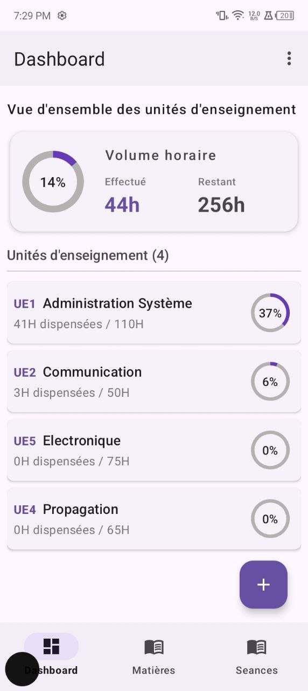
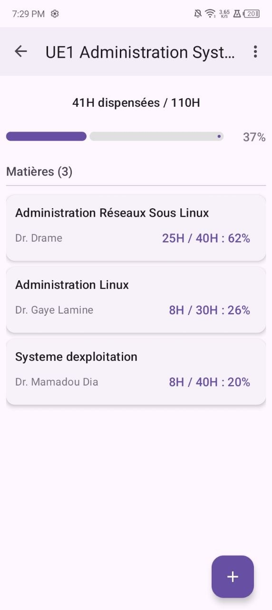
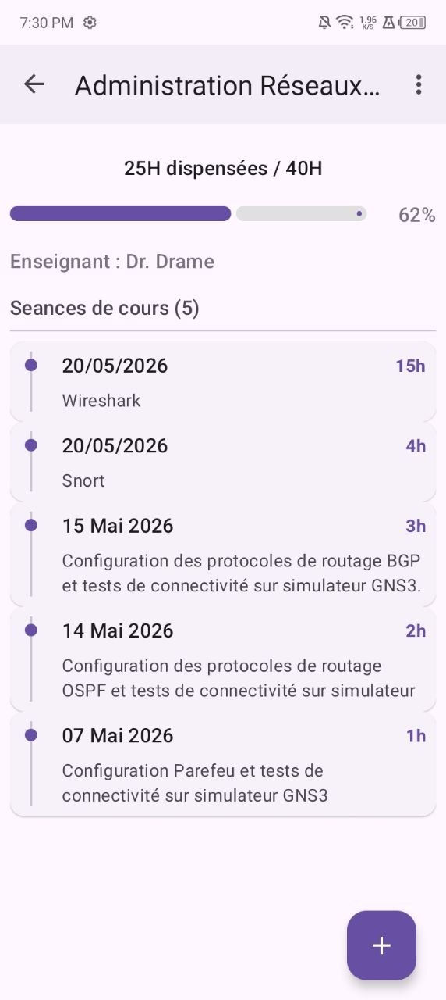
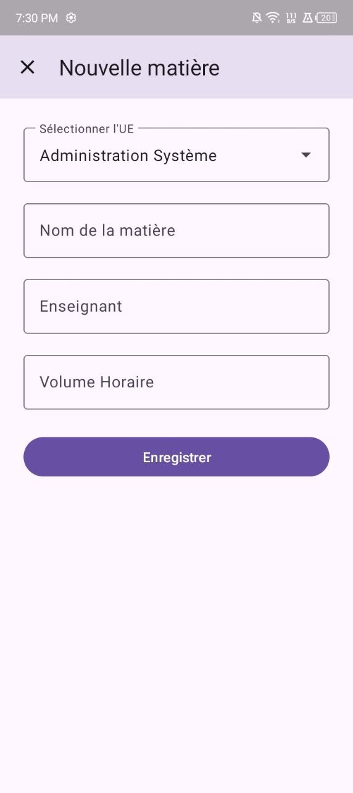
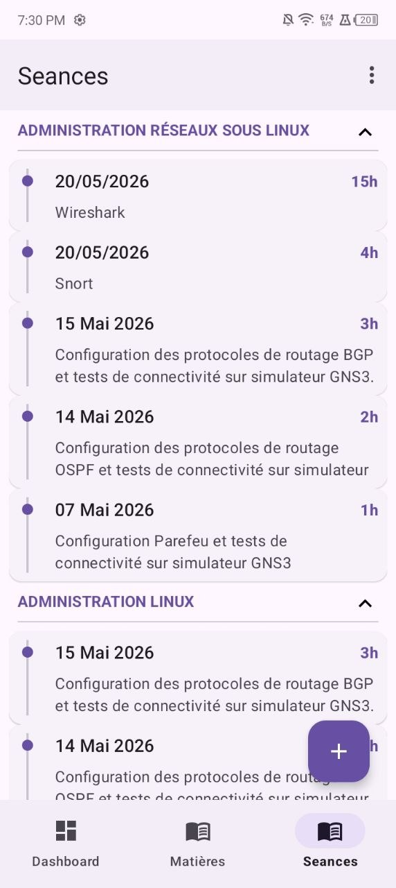
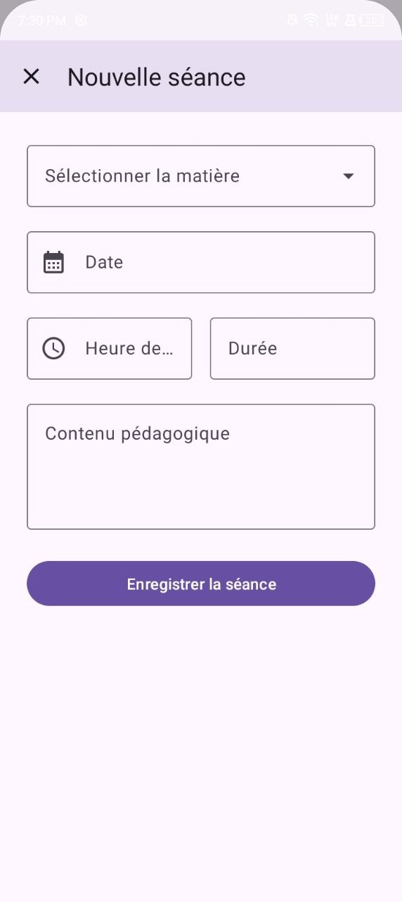

# LogBook
LogBook est un cahier de texte électronique

LogBook est une application de gestion d’un cahier de texte électronique destinée aux responsables de classe.

## Fonctionnalités
Les différentes fonctionnalités implémentées sont :
- gestion des Unités d'Enseignement
- gestion des matières
- gestion des crédits horaires
- gestion du cahier de texte (les informations du cours)

## Screenshots

<table>
  <tr>
    <td align="center">
      <strong>Dashboard</strong> 
      
    </td>
    <td align="center">
      <strong>UE Detail - Matière List</strong> 
      
    </td>
  </tr>
  <tr>
    <td align="center">
      <strong>Ajout d'UE</strong> 
      
    </td>
    <td align="center">
      <strong>Matière Detail - Séance List</strong> 
      
    </td>
  </tr>
  <tr>
    <td align="center">
      <strong>Ajout de matière</strong> 
      
    </td>
    <td align="center">
      <strong>Liste des séances</strong> 
      
    </td>
  </tr>
  <tr>
    <td align="center" colspan="2">
      <strong>Ajout de séance</strong> 
      
    </td>
  </tr>
</table>

[//]: # (![Dashboard]&#40;screenshots/dashboard.jpg&#41;)

[//]: # (![UE Detail, Matière List]&#40;screenshots/ue_detail.jpg&#41;)

[//]: # (![UE Add]&#40;screenshots/ue_add.jpg&#41;)

[//]: # (![Matière Detail, seance List]&#40;screenshots/matiere_detail.jpg&#41;)

[//]: # (![Matière Add]&#40;screenshots/matiere_add.jpg&#41;)

[//]: # (![Seance List]&#40;screenshots/seance_list.jpg&#41;)

[//]: # (![Seance Add]&#40;screenshots/seance_add.jpg&#41;)

